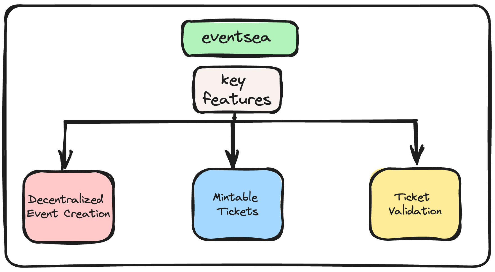

# EventSea: A Decentralized Events Platform

---

### Overview:

EventSea is a decentralized events platform for events organizers and attendees. Built on the top of Linea, EventSea offers a transparent, secure, and user-centric platform for event creation and ticketing.



#### Key Features:

- Decentralized Event Creation:
  Users have the freedom to create their own events without the need for intermediaries or centralized platforms.
  Complete control over event details, ticketing, and updates.

- Mintable Tickets:
  Participants can mint their own tickets, ensuring authenticity and reducing the risk of counterfeit tickets.
  Each ticket is a unique digital asset on the blockchain, providing traceability and security.

### Apps and Packages

- `blockchain`: Contracts
- `web`: another [Next.js](https://nextjs.org/) app
- `ui`: a stub React component library shared by both `web` and `docs` applications
- `eslint-config-custom`: `eslint` configurations (includes `eslint-config-next` and `eslint-config-prettier`)
- `tsconfig`: `tsconfig.json`s used throughout the monorepo

Each package/app is 100% [TypeScript](https://www.typescriptlang.org/).

### Utilities

This Turborepo has some additional tools already setup for you:

- [TypeScript](https://www.typescriptlang.org/) for static type checking
- [ESLint](https://eslint.org/) for code linting
- [Prettier](https://prettier.io) for code formatting

### Walkthrough

You can find a detailed walkthrough with all the prerequisites [here](https://mirror.xyz/emjlin.eth/iNg_5mQCh-k3aLd9tQAUGGxgsMazoo-5E2qrrNNaUJs).

### Deploying locally

First off, make sure you've added all the relevant environment variables in `.env.example` and changed it to a pure `.env`.

The front end accesses the deployed smart contract `EventsFactory` via
`NEXT_PUBLIC_EVENTS_FACTORY_CONTRACT_ADDRESS` environment variable

To deploy your smart contract locally, first start a local test chain by running:

```
npm run blockchain
```

Then, use one of the private keys provided by the local test chain and use it for `ACCOUNT_PRIVATE_KEY` in the `.env` file under `packages/blockchain`.

To actually compile deploy, open a new terminal and run:

```
npm run compile
npm run deploy:local
```

Use that contract address for `NEXT_PUBLIC_EVENTS_FACTORY_CONTRACT_ADDRESS`.

The command below will start the nextjs app

```
npm run dev
```

### Deploying to Linea

In order to deploy it to linea testnet after the compile step, simply run:

```
npm run deploy:test
```
